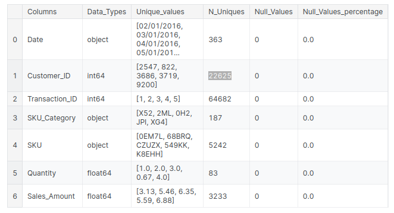
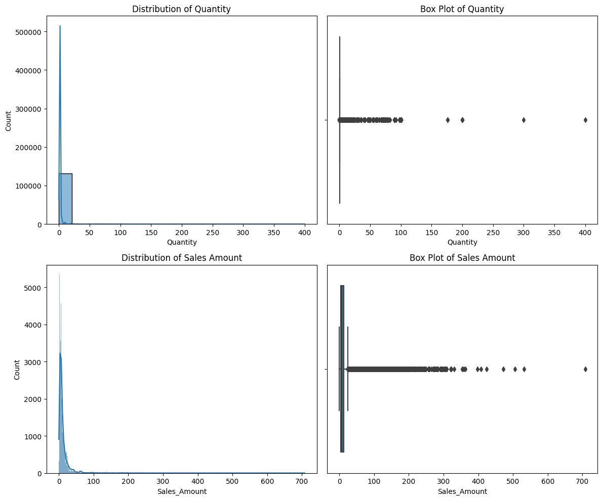
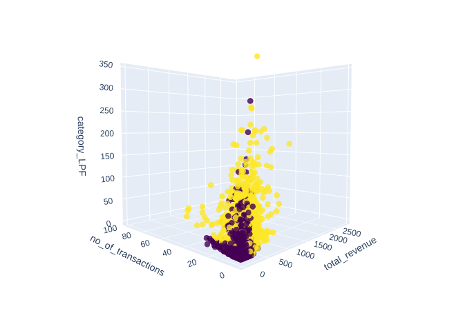
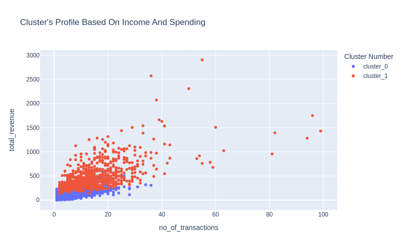
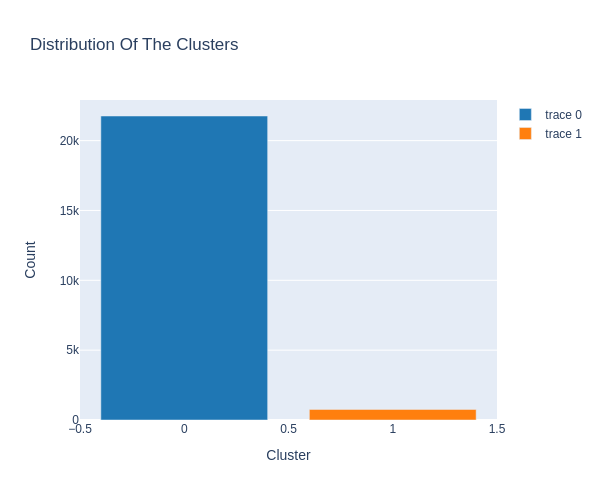

# customer-segmentation

## About the dataset

Dataset has 7 columns. First I got a summery about the dataset

There is no any null values in the dataset.

## Outlier Removal

There are some outlier transactions exists in Quantity and Salse_Amount columns. Some clustering algorithms such as K-means is sensitive to outliers. Therefore those enties have been eliminated using **z score method**.

## Feature Engineering

Following features are created in feature engineering:

1. Total amount spent by a Customer
2. Number of transaction by a customer
3. Amount spent by the customer for each category
4. Quantity baught by the customer for each product

Date, transaction IDs are seems not useful in customer segmentation.

After doing creating features mentioned above there are `5245` features of `22625` customers in the dataframe. Since this is a high dimentional dataframe some feature selection and dimentionality reduction methods are used.

1. **Variency thresholding** is used to remove low variace features. Here any feature with a variance lower than 0.05 will be considered a low-variance feature and will be removed.

2. **Principle Component Analysis(PCA)** is a popular dimentionality reduction and it is used to reduce the number of features. It is a common practice to apply PCA before a clustering algorithm. It is believed that it improves the clustering results in practice by reducing noise.

**Feature scaling** is done using standerdization. It ensures fair contribution of each feature to the clustering process and avoid biased clusters.

## 1. K Means Algorithm

Notebook: [customer-segmentation-k-means](https://www.kaggle.com/code/nirmalsankalana/customer-segmentation-k-means/notebook)

K Means is a distance based clustering algorithm which segment data to K clusters. Each data point is assigned to a cluster based on the distance of the data to the centroid. The centroid is then recalculated based on the mean of all the data points in the cluster. This process is repeated until the centroids do not change.

### Finding the optimal number of clusters

An inappropriate choice of K may lead to either oversimplification or over-complication of the clustering results, rendering them less useful for meaningful insights. There are 2 method used to find the optimal number of clusters:

1. **Elbow Method**: determine the K value where the within-cluster sum of squares (WCSS) exhibits a significant reduction, forming an elbow-like shape in the plot.
2. **Silhouette Method**: quantitatively measures how well each data point fits its assigned cluster compared to neighboring clusters.

Elbow method gave k = 4 and shilhout method gave K = 2. After performing clustering on the data, we can see that the clusters are not well separated and not interpretabale when k = 4. Therefore k = 2 is used.

When K=2 Characteristics of the two clusters are like this:

- **Cluster 0**: Customers who generate less revenue and less often come to the store
- **Cluster 1**: Customers who generate more revenue and more often come to the store

please refer [this](https://www.kaggle.com/code/nirmalsankalana/customer-segmentation-k-means/notebook) notebook for interactive visualisations.

